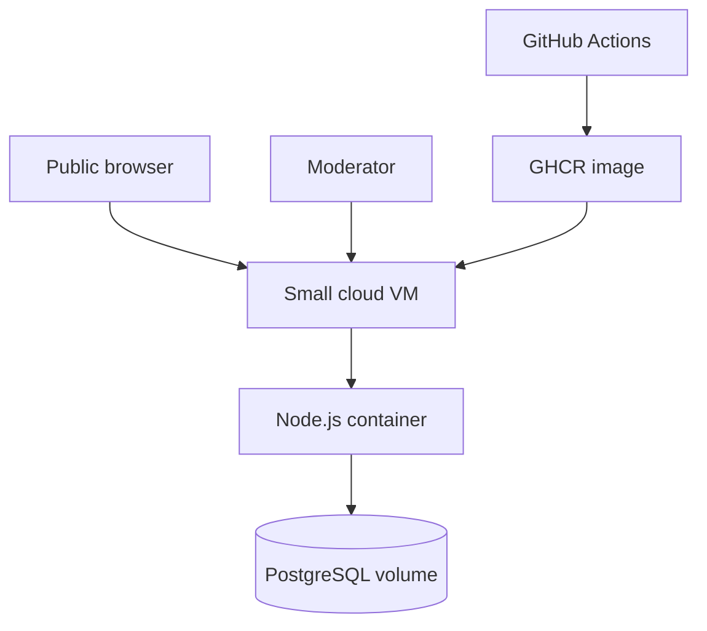

# FlockWatch US

FlockWatch US is a source-linked public-records atlas for documented Flock Safety deployments. It includes a searchable national map, evidence ledger, moderated community sightings, corrections, and a source-ingestion review queue.

The application is cloud-neutral. The same Docker image and PostgreSQL schema run on AWS, Azure, Google Cloud, or Oracle Cloud Infrastructure. Each Terraform stack provisions one economical Linux VM, network controls, persistent local storage, Docker, the application, and PostgreSQL.

> This project is for lawful public-interest research and transparency. Do not trespass, damage equipment, publish personal information, or use the data to facilitate wrongdoing.

## Cost-conscious architecture

The default is deliberately a single-VM deployment. It avoids the recurring cost of a managed load balancer, NAT gateway, Kubernetes cluster, and managed database. Deploy **one** provider stack, not all four.



- Runtime: Node.js 22 and Express
- Database: PostgreSQL 17
- Packaging: Docker and Docker Compose
- Infrastructure: Terraform 1.7+
- Admin security: HTTP Basic authentication
- Default size: approximately 1 vCPU and 2 GB RAM; OCI defaults to an Ampere A1 Flex shape

See [Cost guidance](docs/COSTS.md) before deploying.

## Local development

Requirements: Docker with Compose.

```bash
cp .env.example .env
# Set strong DB_PASSWORD and ADMIN_PASSWORD values.
docker compose up --build
```

- Atlas: http://localhost
- Review desk: http://localhost/admin/
- Health check: http://localhost/health

## Deploy with Terraform

Choose exactly one provider stack. Every stack produces `url`, `admin_url`, and `public_ip` outputs.

```bash
cd infra/aws # or azure, gcp, oci
cp terraform.tfvars.example terraform.tfvars
# Edit terraform.tfvars
terraform init
terraform plan
terraform apply
```

### AWS

Uses EC2, VPC, public subnet, encrypted gp3 storage, Elastic IP, and IMDSv2. Authenticate with `aws configure`.

Stack: [`infra/aws`](infra/aws)

### Microsoft Azure

Uses a Linux VM, resource group, VNet, subnet, NSG, static public IP, and managed OS disk. Authenticate with `az login` and set `subscription_id`.

Stack: [`infra/azure`](infra/azure)

### Google Cloud

Uses Compute Engine, custom VPC/subnet, static address, firewall rules, balanced persistent disk, and Shielded VM controls. Authenticate with `gcloud auth application-default login` and set `project_id`.

Stack: [`infra/gcp`](infra/gcp)

### Oracle Cloud Infrastructure

Uses Compute, VCN, public subnet, internet gateway, route table, security list, and boot volume. The default Ampere A1 Flex shape may qualify for Oracle Always Free capacity, subject to account, region, and capacity availability. Set a matching regional ARM Ubuntu image OCID.

Stack: [`infra/oci`](infra/oci)

## Container publishing

Pushes to `main` publish `ghcr.io/drake-mallard77/flock-detector:latest`. Make the GHCR package public for anonymous VM pulls. If the package is unavailable, VM bootstrap builds the image from this public repository.

## Security and production upgrades

The low-cost stacks expose HTTP on port 80 and restrict SSH using `ssh_source_cidr`. Before a broad public launch:

1. Restrict SSH to your own `/32`.
2. Add a domain and TLS reverse proxy.
3. Add automated encrypted backups before collecting material data.
4. Move PostgreSQL to a managed database only when uptime, scale, or recovery requirements justify its cost.
5. Put credentials in the provider secret manager rather than VM user data.
6. Configure encrypted remote Terraform state with locking.
7. Add rate limiting, spam protection, centralized logs, and monitoring.
8. Replace shared Basic authentication with identity-based authorization.

Sensitive Terraform variables are marked `sensitive`, but their values remain in Terraform state. Protect state accordingly.

## Repository layout

```text
public/                 Browser interface and review desk
src/                    API, database migrations, and server
tests/                  Portable validation tests
infra/templates/        Shared cloud-init and Compose templates
infra/aws/              AWS Terraform root module
infra/azure/            Azure Terraform root module
infra/gcp/              GCP Terraform root module
infra/oci/              Oracle Cloud Terraform root module
.github/workflows/      CI and container publishing
```

Community reports and corrections are private by default. Approved sightings enter as `Under review`; automated ingestion never publishes directly.
